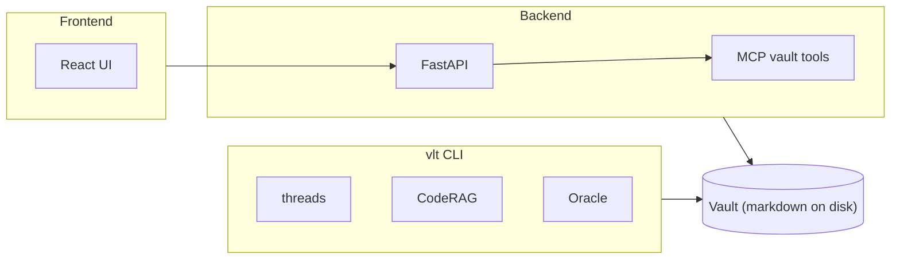

# Vlt-Bridge
Work in Progress

Agent memory and vault bridge in one repo: the **vlt** CLI (threads, CodeRAG, Oracle) and the **Document-MCP** web app (Obsidian-style vault + MCP server). They share the vault concept — markdown on disk — and that’s it. No runtime dependency: agents shell out to `vlt` or talk to the MCP server over HTTP; the CLI does not route through the backend.

This is a RAG for any document. A memory system for agents. And a web chat provider to give agents a phone a friend feature.

**Audience:** Developers and MCP integrators wiring agents to memory/vault; CLI users; anyone running the web UI.

## Quick start by goal

| Goal | Action |
|------|--------|
| **Use the web UI** | Backend: `cd backend && uv run uvicorn src.api.main:app --reload --host 0.0.0.0 --port 8000`. Frontend: `cd frontend && npm install && npm run dev`. UI at http://localhost:5173, API at :8000. |
| **Use vlt CLI** (threads, CodeRAG, Oracle) | `cd packages/vlt-cli && pip install -e ".[oracle]"`, then `vlt profile init` and `vlt config set-key <OPENROUTER_KEY>`. |
| **Connect an MCP client** | Prefer **vlt-mcp** (threads + code + oracle + vault in one server): `claude mcp add --scope user vlt vlt-mcp`. For vault-only: Document-MCP STDIO/HTTP (see MCP Client Configuration). |

## Architecture



CLI and backend both read/write the vault independently. Oracle can run locally (CLI) or in thin-client mode against the backend when it’s running.

## Monorepo layout

```
Vlt-Bridge/
├── backend/              # FastAPI (Document-MCP) + FastMCP STDIO/HTTP
│   └── src/
│       ├── api/          # REST: notes, search, graph, RAG, TTS, auth, oracle
│       ├── mcp/          # MCP server (vault tools only)
│       ├── models/       # Pydantic schemas
│       ├── prompts/      # Oracle prompts
│       └── services/    # vault, indexer, auth, database, rlm_oracle, repl_executor,
│                        # project_context, ans, openrouter_client, ...
├── frontend/             # React 19 + Vite 7 + shadcn/ui
├── packages/
│   └── vlt-cli/          # vlt CLI + vlt-mcp (threads, coderag, oracle, vault)
├── specs/                # SpecKit feature specs
├── data/                 # Runtime data (vaults/, index.db) — gitignored
└── desktop-app/          # Optional Tauri desktop wrapper
```

## vlt CLI

Installed from `packages/vlt-cli`; primary interface for agent memory and Oracle. **Requirements:** Python 3.11+, [OpenRouter](https://openrouter.ai/) API key, `universal-ctags` for Oracle (`apt install universal-ctags`).

**Install:**

```bash
cd packages/vlt-cli
python -m venv .venv && source .venv/bin/activate
pip install -e ".[oracle]"
vlt profile init
vlt config set-key <YOUR_OPENROUTER_KEY>
```

### Thread memory

Threads: per-project, append-only logs. Librarian daemon compresses nodes into semantic state (LLM). `thread push` is tuned for &lt;50ms so agents can log without blocking.

```bash
vlt overview
vlt thread new <project> <thread-id> "goal"
vlt thread push <thread-id> "insight or decision"
vlt thread read <thread-id>
vlt thread read <thread-id> --search "jwt"
vlt thread seek "concept or question"
vlt tag <node-id> "#bug"
vlt link <node-id> <thread-id>
```

Use `--author "AgentName"` on `push` for multi-agent attribution.

### CodeRAG

Hybrid indexing: vector + BM25 + ctags call-graph. Languages: Python, TypeScript, TSX, JavaScript, Go, Rust.

```bash
vlt coderag init --project <id> --path /path/to/repo
vlt coderag init --project <id> --foreground
vlt coderag init --project <id> --force
vlt coderag status --project <id>
vlt coderag search "authentication flow" --project <id>
vlt coderag map --project <id>
vlt coderag map --project <id> --scope src/api/
```

Status: `pending`, `running`, `completed`, `failed`, `cancelled`. Indexing uses the background daemon by default; if the daemon isn’t running, you’re prompted for foreground. Configure with `coderag.toml` in project root (e.g. `include`/`exclude`).

### Oracle

Multi-source query over code index, vault notes, and thread history. **RLM Oracle:** REPL-centric harness. The LLM gets a Python sandbox where the project is exposed as `project`, `sub_oracle`, and `Final`; it writes code to explore and synthesize answers. Loop ends when it sets `Final`. Sandbox: RestrictedPython, 30s timeout, approved stdlib only. No Behavior Tree or XML signals.

```bash
vlt oracle "How does authentication work?"
vlt oracle "Where is UserService defined?" --source code
vlt oracle "Why did we choose SQLite?" --source threads
vlt oracle "Explain the architecture" --local
vlt oracle "Hard question" --thinking --model anthropic/claude-sonnet-4
```

Default: Oracle tries the backend (thin-client, shared with web UI). `--local` forces local. `--explain` shows retrieval traces. `--source` can be `code`, `vault`, or `threads` (repeatable). See [specs/022-rlm-oracle/quickstart.md](specs/022-rlm-oracle/quickstart.md) for backend-side testing.

### Daemon management

```bash
vlt daemon start
vlt daemon stop
vlt daemon status
vlt librarian start
```

### vlt-mcp (unified MCP server)

One server for threads, code, oracle, and vault. No separate daemon/ports for core use. Setup: `claude mcp add --scope user vlt vlt-mcp`. Cold-start ~164ms. Full setup (Claude Desktop, per-project override, oracle toggle): [specs/018-vlt-mcp-server/quickstart.md](specs/018-vlt-mcp-server/quickstart.md).

## Document-MCP

### Web UI

Browser vault viewer/editor; talks to FastAPI on port 8000.

- Wikilinks `[[Note Name]]` via SQLite slug matching (same folder preferred, then lexicographic).
- Full-text search: FTS5, BM25, title 3× weight, recency bonus.
- Backlinks and graph view (force-directed).
- Split-pane editor with live preview; AI chat (RAG + Gemini); TTS (ElevenLabs).
- Optimistic concurrency: `if_version` on save, 409 on conflict.
- Auth: HF OAuth in `space` mode, or local with `LOCAL_USER_ID`.

### MCP server

Seven tools, STDIO or HTTP+JWT: `list_notes`, `read_note`, `write_note`, `delete_note`, `search_notes`, `get_backlinks`, `get_tags`. Vault only; for threads/CodeRAG/Oracle use the CLI or vlt-mcp.

### Running locally

Use the working manual commands (start-dev.sh may need adjustment for your env):

```bash
# Backend
cd backend
uv venv && source .venv/bin/activate
uv pip install -e ".[dev]"
uv run uvicorn src.api.main:app --reload --host 0.0.0.0 --port 8000

# MCP STDIO (Claude Desktop/Code)
uv run python src/mcp/server.py

# MCP HTTP (JWT)
uv run python src/mcp/server.py --http --port 8001

# Frontend
cd frontend
npm install
npm run dev   # http://localhost:5173
```

**Tests:** Backend: `cd backend && uv run pytest` (or `tests/unit`, `tests/integration`, `-k test_vault_write`). Frontend: `cd frontend && npm run lint` (and `npm run build` if you want a production check).

## MCP client configuration

### vlt-mcp (recommended)

```bash
cd packages/vlt-cli && pip install -e ".[oracle]"
claude mcp add --scope user vlt vlt-mcp
```

### Document-MCP backend (vault-only, legacy)

**STDIO:**

```json
{
  "mcpServers": {
    "document-mcp": {
      "command": "uv",
      "args": ["run", "python", "src/mcp/server.py"],
      "cwd": "/absolute/path/to/Vlt-Bridge/backend"
    }
  }
}
```

**HTTP (HF Space + JWT):**

```json
{
  "mcpServers": {
    "document-mcp": {
      "transport": "http",
      "url": "https://YOUR_USERNAME-Document-MCP.hf.space/mcp",
      "headers": {
        "Authorization": "Bearer YOUR_JWT_TOKEN"
      }
    }
  }
}
```

JWT: from the web UI Settings after HF OAuth login.

## Environment variables

Backend and local dev. Source of truth: [backend/src/services/config.py](backend/src/services/config.py) and [backend/.env.example](backend/.env.example).

| Variable | Required | Default | Description |
|----------|----------|---------|-------------|
| `JWT_SECRET_KEY` | yes | — | Min 16 chars. `python -c "import secrets; print(secrets.token_urlsafe(32))"` |
| `VAULT_BASE_PATH` | no | `./data/vaults` | Per-user vault root |
| `ENABLE_LOCAL_MODE` | no | `true` | When true, single-user local mode |
| `LOCAL_USER_ID` | no | `local-dev` | User in local mode |
| `HF_OAUTH_CLIENT_ID` | space | — | HF OAuth client ID |
| `HF_OAUTH_CLIENT_SECRET` | space | — | HF OAuth client secret |
| `GOOGLE_API_KEY` | optional | — | Gemini (RAG / AI chat) |
| `ELEVENLABS_API_KEY` | optional | — | TTS |
| `ELEVENLABS_VOICE_ID` | optional | — | ElevenLabs voice |
| `ORACLE_MAX_TURNS` | no | `30` | Max agent turns per Oracle query |
| `ORACLE_PROMPT_BUDGET` | no | `8000` | Token budget for Oracle system prompt |
| `BASE_URL` | no | `http://localhost:8000` | For widget/assets in production |

SQLite index path defaults to `./data/index.db` (not overridden by env in current code). For full list and security notes (e.g. `ENABLE_NOAUTH_MCP`), see backend `.env.example`.

## Deployment

Backend + frontend are packaged as one Docker image for Hugging Face Spaces. See [DEPLOYMENT.md](DEPLOYMENT.md) for HF Space creation, OAuth, secrets, and push.

```bash
docker build -t vlt-bridge .
docker run -p 7860:7860 -e JWT_SECRET_KEY="dev-secret" vlt-bridge
```

## Extras

- **ANS:** Backend has an Agent Notification System (tool/budget alerts into the Oracle UI). See [CLAUDE.md](CLAUDE.md).
- **ChatGPT widget:** Served at `/widget.html` for embedding in ChatGPT; MCP remains available for other agents.
- **desktop-app:** Optional Tauri app in `desktop-app/`.
- **Specs:** Feature specs live under `specs/` (SpecKit). Deep architecture and implementation notes: [CLAUDE.md](CLAUDE.md).
