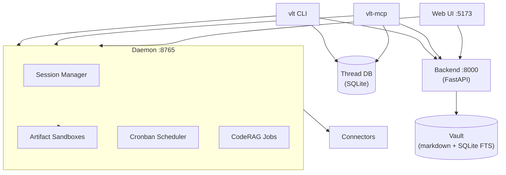

# Vlt-Bridge

Persistent memory, code intelligence, and documentation platform for AI agents.

## What it does

**Memory & Retrieval**
- **Threads** — append-only reasoning logs per project. Librarian compresses nodes into semantic state. `push` is <50ms.
- **CodeRAG** — hybrid code index (vector + BM25 + ctags call-graph). Python, TypeScript, JavaScript, Go, Rust.
- **Oracle** — multi-source Q&A over threads, code, and vault. RLM REPL harness: LLM gets a Python sandbox, writes code to explore, sets `Final` to answer.

**Vault & Web UI**
- Markdown notes with wikilinks, FTS5 search (BM25, title 3x weight), backlinks, graph view.
- Split-pane editor with live preview. AI chat (RAG + Gemini). TTS (ElevenLabs).
- Optimistic concurrency on saves. HF OAuth or local single-user mode.

**Daemon (port 8765)**
- Central hub. Agent session management (Claude Code hooks + SDK subprocess control).
- Artifact sandbox lifecycle. Connector routing. Cronban scheduling. CodeRAG job queue.

**Artifact Sandboxes**
- Sandboxed apps: frontend (HTML/JS) + backend (Python) with bidirectional harness protocol.
- Multi-stage pipelines. Configurable outputs (vault notes, files, connector publish).
- Templates (e.g. `text_factory`: content generation + review + cleanup).

**Connectors**
- Pluggable AI model connectors: OpenRouter, z.ai, z.ai Vision, custom OpenAI-compatible endpoints.
- Composio integrations for external services (Gmail, GitHub, etc).

**Cronban**
- Schedule recurring prompts into live Claude sessions. 5-field cron expressions.

**MCP**
- Unified `vlt-mcp` server: threads + code + oracle + vault + connectors + cronban + artifacts as tools.

## Quick start

```bash
# Web UI + backend
./start-dev.sh                    # backend :8000, frontend :5173

# CLI
cd packages/vlt-cli
pip install -e ".[oracle]"
vlt profile init
vlt config set-key <OPENROUTER_KEY>

# MCP (Claude Desktop/Code)
claude mcp add --scope user vlt vlt-mcp

# Daemon
vlt daemon start
```

## Architecture



## Project structure

```
Vlt-Bridge/
├── backend/                # FastAPI — vault CRUD, search, auth, Oracle, RAG, TTS
│   └── src/
│       ├── api/            # REST routes + middleware
│       ├── mcp/            # MCP server (vault tools, STDIO/HTTP)
│       ├── models/         # Pydantic schemas
│       └── services/       # vault, indexer, database, rlm_oracle, ans, ...
├── frontend/               # React 19, Vite 7, shadcn/ui
├── packages/
│   ├── vlt-cli/            # CLI + daemon + vlt-mcp server
│   │   └── src/vlt/daemon/ # Daemon: sessions, artifacts, cronban, harness
│   └── vlt-connectors/     # Pluggable model connectors (OpenRouter, z.ai, custom)
├── specs/                  # SpecKit feature specs
├── data/                   # Runtime: vaults/, index.db (gitignored)
└── desktop-app/            # Optional Tauri wrapper
```

## CLI reference

### Threads

| Command | Description |
|---------|-------------|
| `vlt overview` | Active projects and thread states |
| `vlt thread new <project> <id> "goal"` | Create a thread |
| `vlt thread push <id> "thought"` | Append a node (<50ms) |
| `vlt thread read <id>` | Read thread state |
| `vlt thread read <id> --search "jwt"` | Filtered read |
| `vlt thread seek "query"` | Semantic search across all threads |
| `vlt thread list --project <id>` | List threads in a project |
| `vlt tag <node-id> "#bug"` | Tag a node |
| `vlt link <node-id> <thread-id>` | Cross-link nodes |

Use `--author "AgentName"` on `push` for multi-agent attribution.

### CodeRAG

| Command | Description |
|---------|-------------|
| `vlt coderag init --project <id> --path <dir>` | Index a codebase |
| `vlt coderag status --project <id>` | Check indexing progress |
| `vlt coderag search "query" --project <id>` | Hybrid search |
| `vlt coderag map --project <id>` | Repo structure overview |
| `vlt coderag map --project <id> --scope src/api/` | Scoped map |

### Oracle

| Command | Description |
|---------|-------------|
| `vlt oracle "question"` | Query (uses backend if available) |
| `vlt oracle "question" --local` | Force local execution |
| `vlt oracle "question" --source code` | Restrict to code index |
| `vlt oracle "question" --thinking` | Show retrieval traces |

### Artifacts

| Command | Description |
|---------|-------------|
| `vlt artifact list` | List all artifacts |
| `vlt artifact create <name> --template text_factory` | Create from template |
| `vlt artifact get <id>` | Inspect artifact details |
| `vlt artifact sync <id> <folder>` | Push local folder to artifact |
| `vlt artifact pull <id> <folder>` | Download artifact to local |
| `vlt artifact call <id> <action> [params_json]` | Run backend action |
| `vlt artifact start/stop <id>` | Control backend process |
| `vlt artifact state <id> <state>` | Transition state |
| `vlt artifact templates` | List available templates |

### Connectors & Cronban

| Command | Description |
|---------|-------------|
| `vlt connectors list` | Available connectors |
| `vlt connectors actions <name>` | Connector action schemas |
| `vlt cron sessions` | List live Claude sessions |
| `vlt cron add <title> <expr> <prompt> --session <id>` | Schedule a prompt |
| `vlt cron list` | Show active schedules |
| `vlt cron pause/resume/delete <id>` | Manage schedules |

### System

| Command | Description |
|---------|-------------|
| `vlt daemon start/stop/status` | Daemon lifecycle |
| `vlt profile init` | Initialize storage profile |
| `vlt config set-key <key>` | Set OpenRouter API key |

## Environment variables

Source of truth: [backend/src/services/config.py](backend/src/services/config.py).

| Variable | Required | Default | Description |
|----------|----------|---------|-------------|
| `JWT_SECRET_KEY` | yes | -- | `python -c "import secrets; print(secrets.token_urlsafe(32))"` |
| `VAULT_BASE_PATH` | no | `./data/vaults` | Per-user vault root |
| `ENABLE_LOCAL_MODE` | no | `true` | Single-user local mode |
| `LOCAL_USER_ID` | no | `local-dev` | User ID in local mode |
| `HF_OAUTH_CLIENT_ID` | space | -- | HF OAuth client ID |
| `HF_OAUTH_CLIENT_SECRET` | space | -- | HF OAuth client secret |
| `GOOGLE_API_KEY` | no | -- | Gemini for RAG / AI chat |
| `ELEVENLABS_API_KEY` | no | -- | TTS |
| `ELEVENLABS_VOICE_ID` | no | -- | ElevenLabs voice |
| `ORACLE_MAX_TURNS` | no | `30` | Max REPL iterations per Oracle query |
| `ORACLE_PROMPT_BUDGET` | no | `8000` | Token budget for Oracle system prompt |
| `BASE_URL` | no | `http://localhost:8000` | Production base URL |

## Deployment

```bash
docker build -t vlt-bridge .
docker run -p 7860:7860 -e JWT_SECRET_KEY="dev-secret" vlt-bridge
```

See [DEPLOYMENT.md](DEPLOYMENT.md) for HF Spaces setup, OAuth config, and secrets.
